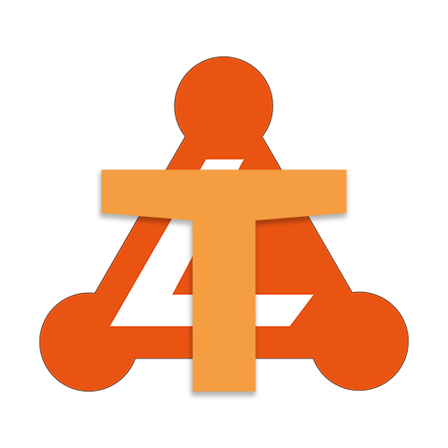

  

<a href='./README_CHS.md' style="background:green;color:white;font-size:20px">中文文档</a>

<h2>This project is under development, the functionality is not comprehensive, welcome to contribute to this project</h2>

##  🤔What is  WhyNotTeaming ?

---

<h4>WhyNotTeaming is a simple solution for team and project management</h4>

## Currently being planned by WhyNotTeaming

Relying on SpringBoot's assistance for gateways, the requests from users passed from SpringBoot are distributed modularly by writing their own logic processing layer to achieve development portability and atomization.
## Currently WhyNotTeaming is thinking about modularity
What is being planned is that the project will start SpringBoot service, get the requests from users and distribute them to WhyNotTeaming for hosting, and WhyNotTeaming will have multiple "independent" "APPs" to handle different requests internally. **"Plugin" is also supported by "APP" related nature**

**For example: **

**WhyNotTeaming has an internal "APP" named [Login], when SpringBoot gets a request from \*\*.com/Login/LoginMethod and forwards it to WhynotTeaming, WhynotTeaming will process it and distribute the request to [ Login] module, the definition of the LoginMethod module is given by Login, WhyNotTeaming does not filter the Method at this level, but gives the request to [Login], usually, WhyNotTeaming sends the request to the "Login" module which is already registered in the Server registered in the Server **

## Composition of 「APP」 and subsequent components 「Plugin」 can be added

#### "APP" consists of two parts.

- The main class located in the core source code in cn.devspace.whynotteaming.App and other defined classes
- The configuration Yaml file of each "APP" in the app folder located in the resources file [resources].

#### [Planning] "Plugin" is in principle a packaged .jar file, which contains

- A path to the class and the classes in it that you can name yourself, e.g. com.helloworld.welcome
- The app.yml configuration file in the root directory of the jar

#### "APP" and "Plugin" both contain the lifecycle

- onLoad - event when the server starts loading the plugin
- onEnable - event when the server is ready
- onCall - event when the server distributes the request to the "APP" or "Plugin"
- onDisable - event when the "App" or "Plugin" is uninstalled